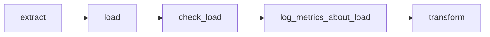
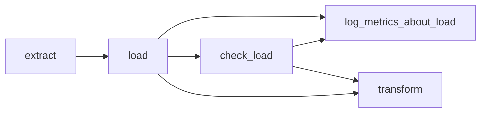

# airflow-aip-31-bonanza
A demo project to show how you can use Airflow AIP-31 for dependency injection, and testing Airflow using some BDD fixtures.

## How to use it

Run either `make test` to see the tests under `tests` folder in action.

Or, `make run` to fire up an Airflow, where you mess around with the example DAG


This repo tries to showcase the following:

## Adding dependencies using xcom

This is a feature added in [AIP-31](https://cwiki.apache.org/confluence/pages/viewpage.action?pageId=148638736). Basically, it adds the ability to add upstream dependencies using the `.output` variable of tasks, if the `.output` reference is used in a **templated** field of another task. The `.output` is basically the return value of the `execute` method of an Airflow Operator. Or, if the operator has multiple outputs, using the `xcom_push` function, it can be reference as a dictionary, for example like so `.output["key_1"]`

So, why is this useful? Well;

### Loose coupling

Using this approach makes DAGs more [loosely coupled](https://en.wikipedia.org/wiki/Loose_coupling), by not using the `{{ xcom_pull(...) }}` strings. With this we can move use tasks in different DAGs, and choose the templated fields ourselves. For example, you might want to create a "backfill DAG", that operates on parts of output that is already created. This backfill DAG can now just hardcode the references, where in the production pipeline we are using `.output`.

### More readable/traceable

#### Airflow UI

First of all, the Airflow UI will represent "the truth" better. You can always use the `>>` and `<<` to infer dependencies, but many times it doesn't show the true dependency. For example, let's say we have this setup:

```python
extract >> load >> check_load >> log_metrics_about_load >> transform
```

represented like this



But, the real representation, showing the true dependencies, could be created like this:
```python
extract = ExtractOperator(...)
load = LoadOperator(source=extract.output, ...)
check_load = CheckLoadOperator(source=load.output, ...)
log_metrics_about_load = LogMetricsOperator(source=load.output, ...)
transform = TransformOperator(source=load.output, ...)

# Force some dependencies
check_load >> log_metrics_about_load
check_load >> transform
```

and should thus be represented like this


Now, we can easily see that the output of load is used in transform. And this becomes very useful, the bigger your DAGs are.

If one then tries to utilise less `<<` and `>>` and more `.output`, these representations are created for free. 

#### Find code references

If you are fortunate, you might find yourself having a lot of code, and be able to reuse a lot of your code as well. One trick, to easily find who is using the output of the Operator, is to add variables that are references to the xcom output. For example the [TwoRandomNumbersOperator](https://github.com/judoole/airflow-aip-31-bonanza/blob/b605cba81313b029a0329745158ad98c714be7e5/dags/components/two_random_numbers_operator.py):
```python
class TwoRandomNumbersOperator(BaseOperator):
    def __init__(self, *args, **kwargs):
        super(TwoRandomNumbersOperator, self).__init__(*args, **kwargs)
        self.output_number_1 = self.output["number_1"]
        self.output_number_2 = self.output["number_2"]

    def execute(self, context):
        self.xcom_push(context, 'number_1', random.randint(1, 100))
        self.xcom_push(context, 'number_2', random.randint(1, 100))
```

Now I can reference `output_number_1` [like so](https://github.com/judoole/airflow-aip-31-bonanza/blob/b605cba81313b029a0329745158ad98c714be7e5/dags/example.py#L54) (example using a `@task` decorator):
```python
print_a_random_number(two_random_numbers.output_number_2)
```

This has now the added benefit that I can easily find all codereferences in most used IDEs, like who is actually using the output of this Operator. And I also get codecompletion on the variable names.

### Caveats

TODO

## Gherkin style tests

TODO
